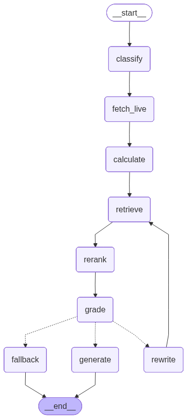

# Architecture

## Overview

FinFortress is a two-phase system: an **ingestion pipeline** that scrapes, processes, and indexes Polish financial content, and a **query pipeline** that retrieves and generates answers using a self-correcting agentic loop.

```
Ingestion (offline, scheduled)
  Sources → Loaders → Chunker → Embedder → Qdrant

Query (online, per request)
  Question → Classify → Retrieve → Rerank → Grade → [Rewrite →] Generate → Answer
```

The two phases share only the Qdrant vector store. They can run independently — ingestion does not need the API to be up, and the API does not need ingestion to be running.

---

## Ingestion pipeline

### Source loaders

Each source type has a dedicated loader. The loaders are intentionally separate scripts, not a unified crawler, because each source has different structure, rate limits, and update frequency.

**Blog HTML (inwestomat.eu, marciniwuc.com)**
Uses `requests` + `BeautifulSoup`. The loader targets article body selectors specifically — `article`, `.entry-content`, `.post-content` — and strips nav, footer, sidebar, and cookie banner content before passing to the chunker. This is the most important cleaning step: footer text and nav links embedded as chunks severely degrade retrieval quality.

Politeness: 1.5s delay between requests, `User-Agent` identifying the bot, `robots.txt` respected. Both bloggers are indexed for personal/non-commercial use consistent with standard search engine crawling practice.

**PDFs (KNF, NBP, podatki.gov.pl, BGK)**
Uses `PyMuPDF` (fitz) as primary extractor. Falls back to `pdfplumber` for PDFs where PyMuPDF produces garbled text (common with older scanned government documents). Falls back further to `pytesseract` OCR for fully scanned PDFs. The loader logs which fallback was used per file for debugging.

**Excel / CSV (obligacje rates, NBP tables)**
Uses `pandas`. Each row becomes a separate `Document`. Column headers are prepended to each row as context: `"Seria: COI0325, Oprocentowanie: 6.55%, Data wykupu: 2027-03-01"`. This makes individual rows retrievable by semantic search.

**Video transcripts (YouTube)**
Uses `yt-dlp` to download audio, then `openai-whisper` (base model for speed, medium for accuracy) to transcribe. Chunks are 30-second windows with 5-second overlap. Timestamp is stored in metadata so citations can link to the exact video moment. This step is run manually, not on a schedule — it's slow and only triggered for high-value videos.

### Chunking strategy

`RecursiveCharacterTextSplitter` with:
- `chunk_size=512` tokens
- `chunk_overlap=64` tokens
- `separators=["\n\n", "\n", ". ", " "]`

The separator hierarchy means the splitter prefers to break on paragraph boundaries, then line breaks, then sentence endings. This preserves semantic coherence better than fixed-character splitting.

512 tokens is chosen as the default after testing on a sample of Inwestomat articles. Smaller chunks (256) lose the surrounding context that explains financial terms. Larger chunks (1024) dilute the embedding by mixing multiple topics.

Exception: legal text from `isap.sejm.gov.pl` uses `chunk_size=1024` because individual legal articles are self-contained units that should not be split.

### Idempotent embedding

Before embedding, each chunk is hashed with SHA-256 of its `(url + chunk_index + page_content)`. The hash is stored as a Qdrant payload field. On subsequent runs, chunks whose hash already exists in Qdrant are skipped. This makes the ingestion pipeline safe to re-run without duplicating data or wasting embedding compute.

---

## Query pipeline

### LangGraph graph

The agent is a directed graph with conditional edges. Nodes are pure Python functions that read from and write to a shared `AgentState` TypedDict. LangGraph manages execution order and state passing.



Solid arrows are unconditional edges. Dashed arrows are conditional — the edge after `grade` inspects `state["needs_rewrite"]`, `state["stale_data"]`, and `state["rewrite_count"]` to decide which node runs next.

To regenerate this diagram from the live graph definition: `just graph`.

### Query classification

The first node classifies the question into one of four types before retrieval. Classification determines which tools to arm and whether a disclaimer is required in the output.

| Type | Example | Effect |
|---|---|---|
| `factual` | "Jaki jest limit IKE w 2025?" | Standard retrieval |
| `calculation` | "Ile zaoszczędzę na IKZE przy JDG liniowym?" | Runs `calculate` node → pure-Python math, then RAG |
| `comparison` | "IKE vs IKZE — co wybrać?" | Retrieves for both topics, merges context |
| `advice` | "Czy powinienem kupić ETF czy obligacje?" | Adds disclaimer to output |

### Financial calculator

When `query_type == "calculation"`, the `calculate` node runs between `fetch_live` and `retrieve`. It uses the small LLM (grader model) to extract structured parameters from the question, then calls a pure-Python formula — no risk of LLM arithmetic errors.

**Available formulas (`agent/tools/calculator.py`):**

| Formula | What it computes |
|---|---|
| `ikze_shield` | Annual IKZE tax saving given contribution + marginal rate (JDG liniowy 19%, skala 12%/32%) |
| `ike_ikze_limits` | Annual contribution limits for IKE and IKZE, with remaining headroom if YTD contributions known |
| `belka` | 19% Belka capital gains tax — exempt in IKE, gain-exempt in IKZE |
| `mortgage_vs_invest` | Effective return comparison: overpayment (guaranteed loan rate) vs investing (after Belka) |
| `cash_allocation` | Idle cash split across IKE / mortgage / COI obligacje / savings. Allocates sequentially: IKE limit first (Belka-free), then best remaining option by after-tax return. IKZE reported separately. Triggered by: "gdzie ulokować", "co z gotówką", "alokacja gotówki". |

The `calculate` node returns `calc_result` — a formatted string injected into the generate prompt with the instruction "use these numbers, do not recalculate." If the question is a calculation type but doesn't match any formula, `calc_result` is `None` and the pipeline falls back to RAG alone.

Limits in `ike_ikze_limits()` are hardcoded per year — update each January when the MF announces the new multiplier.

### Hybrid retrieval

Two retrievers run in parallel and results are merged with Reciprocal Rank Fusion (k=60):

**Dense retrieval (Qdrant)**
`multilingual-e5-large` embeddings, cosine similarity, top-12. Qdrant's `Filter` is applied when classification suggests a specific source type (e.g. factual tax questions filter to `content_type: pdf_gov` to reduce blog-opinion noise).

**Sparse retrieval (Qdrant native sparse vectors)**
TF sparse vectors stored in Qdrant alongside the dense vectors, with `Modifier.IDF` applied server-side at query time. Text is tokenized via `simplemma` Polish lemmatization (`kredytu`/`kredytów`/`kredytem` → `kredyt`) with `re.findall(r"\w+", ...)` splitting (handles `WIBOR,` → `wibor`). Each lemma is hashed to a stable 32-bit ID (`zlib.crc32`); per-document term frequencies are computed at ingest time and stored as `SparseVector`. At query time, a binary sparse query vector (weight 1.0 per unique lemma) is sent to Qdrant, which multiplies by server-side IDF weights and returns top-K by dot product.

This replaces the previous `rank-bm25` in-memory index that required scrolling all chunk texts at startup (~114 MB pickle for 72k chunks). The sparse index lives entirely in Qdrant — startup is a single metadata request, not a full corpus scan.

**Why hybrid**: Dense retrieval finds semantically similar chunks even when keywords differ ("konto emerytalne" matches "IKE"). BM25 finds exact term matches ("WIRON 3M 2025-01") that dense search can miss when the term is rare in training data. RRF consistently outperforms either retriever alone on financial Q&A.

**Weights**: BM25 40%, dense 60%. Tuned on the golden test set. Financial queries tend to contain specific Polish terms (product names, legal references) that benefit from keyword matching.

RRF keeps the top 12 fused candidates — a deliberately wide pool that the reranker then narrows.

### Cross-encoder reranking

Between fusion and grading, the `rerank` node scores every fused candidate against the question with a cross-encoder (`BAAI/bge-reranker-v2-m3`, multilingual incl. Polish, loaded once at startup) and forwards only its top 6 to the grader.

**Why a cross-encoder here**: dense and sparse retrieval score query and chunk *independently* (bi-encoder / term overlap), so a chunk can rank high on surface similarity yet not actually answer the question. A cross-encoder reads the (question, chunk) pair jointly and produces a far sharper relevance signal — at the cost of running once per candidate, which is why it sits after fusion (12 pairs) rather than over the whole corpus. It runs locally on CPU/MPS in ~100–200 ms for 12 pairs, no API cost.

**Why before the grader, not instead of it**: the grader does more than rank — it emits `temporal_mismatch` and drives the rewrite loop. The reranker only reorders and trims, feeding the grader a cleaner top 6 so its expensive LLM calls are spent on the most promising chunks. Output scores are raw logits used only for sorting; there is no threshold.

Set `RERANK_ENABLED=false` to bypass the cross-encoder (the node then just trims the fused pool to `RERANK_TOP_K`) — useful for before/after benchmarking. See `docs/configuration.md` for `RERANK_MODEL` / `RERANK_TOP_K`.

### Context grading

The grader uses `gpt-4o-mini` with a structured output prompt that returns:

```json
{
  "score": 0.0,
  "temporal_mismatch": false,
  "reason": "..."
}
```

**Relevance score**: 0.0–1.0 measuring how directly the chunk answers the question. Threshold is 0.6 — below this, the chunk is treated as noise.

**Temporal mismatch**: True when the document date is more than 18 months old AND the question implies current data (detected by keywords: "teraz", "aktualny", "2025", "obecny", "ile wynosi"). 18 months chosen because most Polish financial regulations (IKE limits, tax brackets) change yearly in January, and a 2023 document answering a 2025 question is likely wrong.

The average score across all retrieved chunks must exceed 0.6 for the pipeline to proceed to generation. If any chunk has `temporal_mismatch=True`, the pipeline treats the whole retrieval as stale regardless of average score.

**Why a separate grader model**: Using GPT-4o for grading would be 10x more expensive and adds latency. GPT-4o-mini is sufficient for binary relevance classification and temporal detection. The main model is reserved for generation where nuance matters.

### Query rewriting

When grading fails, the rewriter LLM is given the original question, the failed chunks, and the failure reason (low relevance vs temporal mismatch). It produces a more specific query:

- Low relevance: adds specificity ("IKE" → "limit rocznych wpłat na IKE 2025 Polska")
- Temporal mismatch: adds date constraints AND arms the live NBP or obligacje tool to supplement stale indexed data with fresh API data

Maximum 2 rewrites. After 2 failed attempts, the fallback node returns a transparent response that explains the limitation and suggests authoritative sources the user can check directly (KNF, NBP, podatki.gov.pl).

### Answer generation

The generator uses GPT-4o with a system prompt that enforces:
1. Every factual claim is cited with source name, author, and date
2. Confidence level is stated (high/medium/low) based on avg_grade
3. Advice queries include a financial disclaimer
4. The answer is in the same language as the question (Polish or English)
5. If `live_data` is present, it is used for current rate figures and cited as "NBP (live, fetched today)"

Output is a structured Pydantic model, not free text, so the API can render citations as interactive elements.

### Conversation memory

The graph is compiled with an `AsyncSqliteSaver` checkpointer (`data/memory.sqlite`). The async variant is required because the `grade` node is an `async def` function — LangGraph must call `ainvoke` throughout, which in turn requires an async-capable checkpointer. Each invocation is identified by a `thread_id`; LangGraph saves the full `AgentState` after every node execution.

On subsequent messages in the same thread, the checkpointer restores the saved state. The `history` field in `AgentState` accumulates `{"question": ..., "answer": ...}` pairs — up to 10 turns stored, last 5 injected into the generation prompt as a history block.

**Per-query state reset**: fields that should not carry over between questions (context, grades, rewrites) are explicitly reset on each invocation. Only `history` is preserved via the checkpointer — it is excluded from the reset dict so the checkpointer value survives the merge.

```python
# What gets passed on each new message:
reset_input = {k: v for k, v in INITIAL_STATE.items() if k != "history"}
reset_input["question"] = new_question
app.invoke(reset_input, config={"configurable": {"thread_id": thread_id}})
```

Thread data persists across API restarts. Different `thread_id` values are fully isolated.

---

## Live tools

Three tools are called by the `fetch_live` node when `needs_live_data=True`. Which tools fire depends on keyword matching against the question. All are implemented as pure fetch functions — no LLM involved.

**`nbp_rates`** (`agent/tools/nbp_rates.py`): Calls `api.nbp.pl` for EUR/USD/CHF/GBP exchange rates and reference rate. Triggered by keywords: WIBOR, WIRON, kurs, waluta, NBP.

**`obligacje_rates`** (`agent/tools/obligacje_rates.py`): Scrapes current bond rates from `obligacjeskarbowe.pl` (no official API). Returns current rates for COI, EDO, ROS series. Triggered by: obligacje, COI, EDO.

**`etf_prices`** (`agent/tools/etf_prices.py`): Fetches live ETF NAV via `yfinance`, converts to PLN using NBP EUR/PLN rate, and formats unrealised P&L per position. Triggered by portfolio keywords (portfel, zysk, strata, ile warte, ticker names). Reads ETF positions from the loaded user profile using a regex parser — no LLM call.

The `fetch_live` node is a factory (`build_fetch_live_node(profile_text="")`) so it can close over the loaded profile without storing it in `AgentState`.

None of these tools are indexed. Indexing daily-changing data creates stale information that the grader would catch but the user might miss.

---

## Embedding model choice

`intfloat/multilingual-e5-large` (1024 dimensions) over OpenAI `text-embedding-ada-002` (1536 dimensions) for three reasons:

1. **Polish vocabulary**: e5-large was trained on multilingual data including Polish. It correctly places "kredyt hipoteczny" near "mortgage" and "WIBOR" near "floating rate". Ada-002 shows significantly lower retrieval accuracy on Polish financial terms in benchmark testing.

2. **Cost**: e5-large runs locally. Zero API cost per embedding call. For a corpus of 20,000 chunks re-embedded weekly, this is non-trivial.

3. **Data privacy**: User questions are never sent to OpenAI's embedding endpoint. Only generation calls leave the local environment.

Downside: e5-large requires ~3GB of VRAM or is slow on CPU. On CPU-only machines, use `intfloat/multilingual-e5-base` (768 dimensions) which is meaningfully faster with modest quality loss.

---

## Vector store choice

Qdrant over alternatives:

| | Qdrant | Chroma | FAISS | Pinecone |
|---|---|---|---|---|
| Persistence | Docker volume | SQLite | File | Cloud |
| Metadata filtering | Rich payload filters | Basic | None | Basic |
| Hybrid search | Native sparse + dense | No | No | Yes |
| Self-hosted | Yes | Yes | Yes | No |
| Production-ready | Yes | Partial | No | Yes |

Metadata filtering is essential for this project: temporal mismatch detection requires filtering by `year`, source filtering requires filtering by `content_type` and `source`. Chroma's filtering at the time of implementation was too limited. FAISS has no filtering. Pinecone requires cloud dependency.

---

## Evaluation

See `docs/evaluation.md` for methodology. The golden test set (`data/eval/test_questions.json`) contains 30 questions covering all query types and all source domains. RAGAS metrics tracked per pipeline change:

- **Faithfulness**: are all answer claims supported by retrieved context?
- **Answer relevance**: does the answer address the question asked?
- **Context recall**: does the retrieved context contain the information needed?
- **Context precision**: are retrieved chunks relevant, or is there noise?

A GitHub Actions workflow runs RAGAS on every merge to main and posts results as a PR comment. Pipeline changes that drop faithfulness below 0.85 or context recall below 0.80 are blocked.
